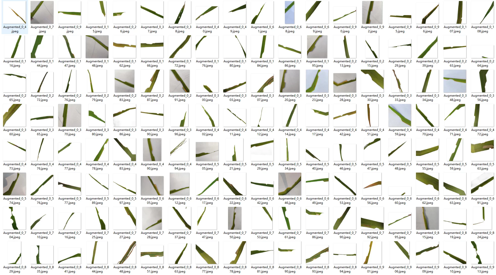
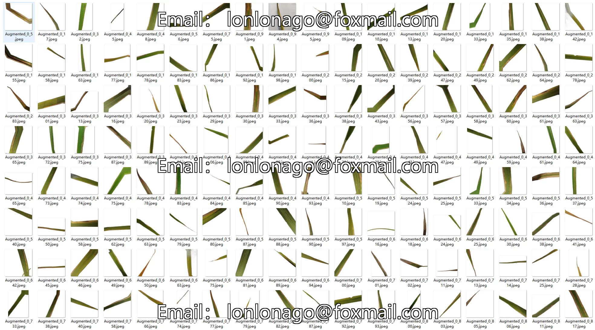
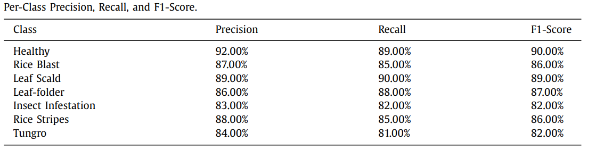

## Body

（Agricultural Product）Rice 7 Class Disease Classification Data Set, Including Collection Sites

Number of Images: Original Image: 2753, Data Augmentation: 16247, Totaling 19000. The original images and data augmented images are stored separately.

Data Categories
English Name | Chinese Name | Original Image Count
Healthy | Healthy Leaves | 603
Rice Blast | Rice Blast | 696
Scald (Leaf tip blight) | Scald (Leaf tip blight) | 421
Leaf-folder Injury | Rice Leaf Rollerworm Injury | 247
Insect Infestation | Common Insect Infestation | 281
Rice Stripes | Rice Stripe Disease | 266
Tungro Disease | Donggru Disease | 239

Containing Author's Article
The author's article specifies the collection sites (latitude and longitude and collection time)

Electronic virtual products are sold without returns or exchanges.

## Images

Here is a pay link on Stripe ( https://buy.stripe.com/3cs8yP7sY87d0vu9AB ). Please contact me lonlonago@foxmail.com after funding $89, and I will send you a complete data files , thank you!

